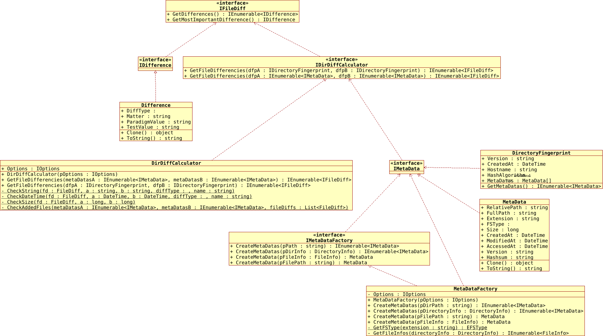

[](https://www.gnu.org/licenses/gpl-3.0)
[](https://github.com/pediRAM/DirectoryFingerPrintingLibrary/releases)
[](https://www.nuget.org/packages/DirectoryFingerPrinting.Library)

# DirectoryFingerPrinting.Library
**DirectoryFingerPrinting.Library** (сокращенно **DFP lib**) - это мощная библиотека .NET/C#, разработанная для создания и сбора контрольных сумм и метаданных файлов и каталогов, предназначенная для проведения судебно-экспертных, версионных или задач управления изменениями.

**Цель:** Эта библиотека предоставляет типы и методы для извлечения всех или определенных (настраиваемых) различий между файлами в двух каталогах. Сохраните текущее состояние (метаданные всех файлов) каталога в качестве небольшого файла **DFP**, затем вы сможете сравнить содержимое каталога с файлом **DFP** и определить, были ли какие-либо изменения, и если да, то что было изменено в этом каталоге.

Библиотека **DFP** предлагает полный набор функций, включая:

- Извлечение метаданных, таких как **контрольная сумма**, дата создания, **дата последнего изменения** и **размер** для файлов в каталоге и подкаталогах (рекурсивно).
- **Вычисление контрольных сумм** (**хешей**) для всех файлов в каталоге.
- **Сравнение и обнаружение изменений** между двумя каталогами или файлами отпечатков.

## Основные функции
- **Получение метаданных файлов**: Доступ к датам создания, датам модификации, размерам и другим данным.
- **Вычисление контрольных сумм**: Генерация хеш-значений (например, SHA-1) для файлов в каталоге.
- **Определение изменений**: Обнаружение добавлений, удалений и модификаций файлов.
- **Эффективное сравнение файлов**: Быстрое сравнение и отчет о различиях между каталогами.
- **Выбор алгоритмов хеширования**: CRC32, MD5, SHA1, SHA256, SHA512

## Диаграмма классов UML


## Пример кода
```cs
public void Demo()
{
   // Создание настроек:
   IOptions options = new Options
   {
         UseHashsum = true,
         UseSize = true,
         UseVersion = true,
         UseLastModification = true,
         HashAlgo = EHashAlgo.SHA512,
         // Дополнительные опции...
   };

   // Создание фабрики метаданных:
   IMetaDataFactory metaDataFactory = new MetaDataFactory(options);

   // Получение метаданных для одного файла:
   IMetaData metaData1 = metaDataFactory.CreateMetaData(@"C:\dir\filePath.ext");
   IMetaData metaData2 = metaDataFactory.CreateMetaData(new FileInfo(@"C:\dir\filePath.ext"));

   // Получение метаданных для файлов в каталоге:
   IEnumerable<IMetaData> metaDatasB = metaDataFactory.CreateMetaDatas(@"C:\dirPath");
   IEnumerable<IMetaData> metaDatasA = metaDataFactory.CreateMetaDatas(new DirectoryInfo(@"C:\dirPath"));

   // Создание фабрики калькулятора различий:
   IDirDiffCalculator diffCalculator = new DirDiffCalculator(options);

   // Получение различий между файлами в A и B:
   IEnumerable<IFileDiff> differences1 = diffCalculator.GetFileDifferencies(metaDatasA, metaDatasB);

   // Получение различий между двумя файлами DFP:
   IDirectoryFingerprint dfpA = null;
   IDirectoryFingerprint dfpB = null;
   // Загрузка/конвертация dfp A...
   // Загрузка/конвертация dfp B...

   // Получение различий между dfpA и dfpB:
   IEnumerable<IFileDiff> differences2 = diffCalculator.GetFileDifferencies(dfpA, dfpB);

   // Показать или сохранить differences2...
}
```
