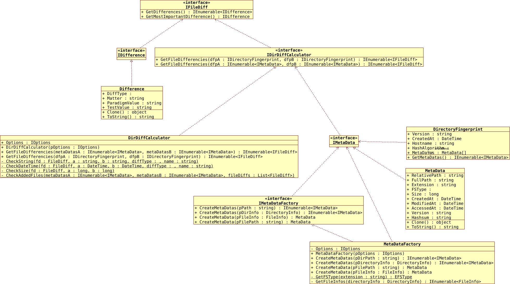

[](https://www.gnu.org/licenses/gpl-3.0)
[](https://github.com/pediRAM/DirectoryFingerPrintingLibrary/releases)
[](https://www.nuget.org/packages/DirectoryFingerPrinting.Library)

# DirectoryFingerPrinting.Library
**DirectoryFingerPrinting.Library** (kısaltma: **DFP lib**), adli, sürüm veya değişiklik yönetimi görevleri için dosya ve dizin özetlerini ve meta verilerini oluşturmak ve toplamak için tasarlanmış güçlü bir .NET/C# kütüphanesidir.

**Amaç:** Bu kütüphane, iki dizin arasındaki dosyaların tümünü veya belirli (ayarlanabilir) farkları almak için türler ve yöntemler sunar. Bir dizinin mevcut durumunu (tüm dosyaların meta verileri) küçük bir **DFP** dosyası olarak kaydedin. Daha sonra, dizinin içeriğini **DFP** dosyası ile karşılaştırabilir ve böylece herhangi bir değişiklik olup olmadığını ve öyleyse o dizinde neyin değiştiğini tanımlayabilirsiniz.

**DFP** kütüphanesi, şunları içeren kapsamlı bir özellik seti sunar:

- Bir dizinde ve alt dizinlerinde (rekürsif olarak) dosyalar için **özet**, oluşturma tarihi, **son değiştirme tarihi** ve **boyut** gibi meta verilerin alınması.
- Bir dizin içindeki tüm dosyalar için **özetlerin (hash'lerin) hesaplanması**.
- İki dizin veya parmak izi dosyası arasındaki **farkları karşılaştırma ve algılama**.

## Temel Özellikler
- **Dosya meta verilerini alın**: Oluşturma tarihleri, değiştirme tarihleri, boyutlar ve daha fazlasına erişin.
- **Özetlerin (hash'lerin) hesaplanması**: Bir dizindeki dosyalar için hash değerlerinin (örneğin, SHA-1) oluşturulması.
- **Değişikliklerin belirlenmesi**: Dosyaların eklemelerini, kaldırmalarını ve değişikliklerini tespit edin.
- **Verimli dosya karşılaştırmaları**: Dizinler arasındaki farkları hızlı bir şekilde karşılaştırın ve raporlayın.
- **Seçilebilir hash algoritmaları**: CRC32, MD5, SHA1, SHA256, SHA512

## UML Sınıf Diyagramı


## Demonstrasyon Kodu
```cs
public void Demo()
{
   // Ayarlar oluşturma:
   IOptions options = new Options
   {
         UseHashsum = true,
         UseSize = true,
         UseVersion = true,
         UseLastModification = true,
         HashAlgo = EHashAlgo.SHA512,
         // Daha fazla seçenek...
   };

   // Meta veri fabrikası oluşturma:
   IMetaDataFactory metaDataFactory = new MetaDataFactory(options);

   // Bir tek dosya için meta verileri alın:
   IMetaData metaData1 = metaDataFactory.CreateMetaData(@"C:\dir\filePath.ext");
   IMetaData metaData2 = metaDataFactory.CreateMetaData(new FileInfo(@"C:\dir\filePath.ext"));

   // Bir dizindeki dosyalar için meta verileri alın:
   IEnumerable<IMetaData> metaDatasB = metaDataFactory.CreateMetaDatas(@"C:\dirPath");
   IEnumerable<IMetaData> metaDatasA = metaDataFactory.CreateMetaDatas(new DirectoryInfo(@"C:\dirPath"));

   // Fark hesaplayıcı fabrikası oluşturma:
   IDirDiffCalculator diffCalculator = new DirDiffCalculator(options);

   // A ve B'deki dosyalar arasındaki dosya farklarını alın:
   IEnumerable<IFileDiff> differences1 = diffCalculator.GetFileDifferencies(metaDatasA, metaDatasB);

   // İki DFP (dosya) arasındaki dosya farklarını alın:
   IDirectoryFingerprint dfpA = null;
   IDirectoryFingerprint dfpB = null;
   // DFP A yükleme/dönüştürme...
   // DFP B yükleme/dönüştürme...

   // dfpA ve

 dfpB arasındaki dosya farklarını alın:
   IEnumerable<IFileDiff> differences2 = diffCalculator.GetFileDifferencies(dfpA, dfpB);

   // Farkları göster veya kaydet...
}
```
