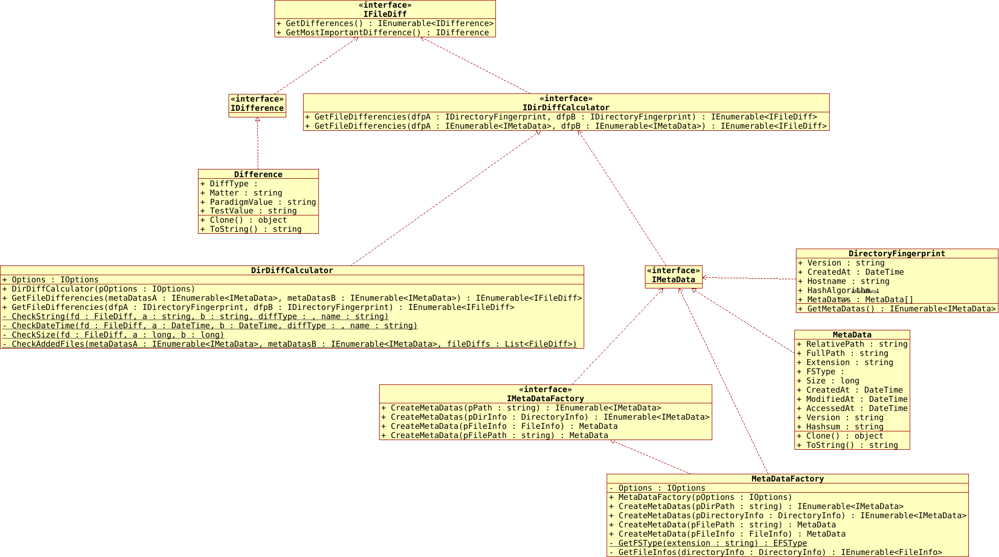

## **IRAN IS BLEEDING --- AND THE WORLD IS SILENT**
BEGIN OF UPDATE: 2026-01-18
LAST UPDATEL: 2026-02-18

# Massacre in IRAN
## The Media is Silent!
## BBC and CNN use the narative and political framing of the criminal Islamist Djihadist Mullah Regime of Iran
### 20 Mil. USD have been paid to influencers and PR companies in western countries to relativate, deny, negate and downsize the Crimes of Islamist Djihadist Republic of Iran
### The western Democracies are infiltraded by hundreds of NGOs and Consulting Institutions of Islamist Criminal Republic of Iran

[**The Slaughterer and Tyranny Regime of Mullahs is Slaughtering their protesting Nation and the Media was and is silent for a very long time!**](https://www.youtube.com/watch?v=x36HO4BiPYI)

This Regime has killed at least ~12000+~ 40000+ protestors in 48 hours (8th - 9th Jan. 2026),
after [turning off the internet](https://mastodon.social/@netblocks/115979334965828202), Mobile-net, telephone-net and even electricity and they started to 
disturb the satellite frequencies by military jammers from china, to also [turn off the internet connection through Starlink](https://www.techpolicy.press/what-irans-internet-shutdown-reveals-about-starlink/)!

But some brave people which traveled to abroud smuggled a lot of images and videos, but also figures/statistics collected
by brave doctors in Iran. The figures/numbers currently after ~three~ six weeks of protesting are:
- Death toll: ~60000+~ 94000+ since 2026-01-18 until today 21th Feb. 2026 (secret services estimate numbers over 100000!)
- Blined: ~8000+~ 10000+
- Wounded: 350000+
- Detained: 130000+ (which is decreasing due to daily silent mass executions)

When the family of killed protestors try to get the dead body, [**they have to pay the "bullet-price" of 5000 to 7000 USD for each Bullet!**](https://www.youtube.com/watch?v=dmPnGJG8yQw&t=935s)
An average worker earns about 100 to 200 USD per month!

**The bodies of those whose relatives cannot afford the bullet-price are buried in mass graves without names or any other identifying information or markings at unknown locations.**

Car and ferniture are also confiscated.

Scared from ***Final Shot*** of Regime-Thugs, [many wounded people are scared to go to hospitals or doctors](https://www.bbc.com/news/articles/c5yx015nkplo), so they lie at home and ***die slowly due to Infections or Internal Bleedings***.

**Now(2026-01-18), after 120+ hours of internet-shuttdown, they turn it for some time on to transfere their BitCoins to wallets out of iran!**
[Netblocks.org Iran](https://mastodon.social/@netblocks/115916598029882510)

The regime thugs [**invaded into hospitals by force and killed wounded people by final shot.**](https://www.youtube.com/watch?v=RcxE5OX4TDo&t=74s)

The Doctors and Nurses, resisted against the regime thugs, have [**also been killed or detained with death sentence!**](https://www.bbc.com/news/articles/c5yx015nkplo)

END OF UPDATE.


[](https://www.gnu.org/licenses/gpl-3.0)
[](https://github.com/pediRAM/DirectoryFingerPrintingLibrary/releases)
[](https://www.nuget.org/packages/DirectoryFingerPrinting.Library)

This is the english documentation. Following translations are available:
- [普通话 (Mandarin) :cn:](Documentation/Mandarin.md)
- [Español :es:](Documentation/Spanish.md)
- [Pусский :ru:](Documentation/Russian.md)
- [Deutsch :de: :austria: :switzerland:](Documentation/German.md)
- [हिंदी :india:](Documentation/Hindi.md)
- [Türkçe :tr:](Documentation/Turkish.md)
- [فارسی :iran: :afghanistan: :tajikistan:](Documentation/Farsi.md)


# DirectoryFingerPrinting
**DirectoryFingerPrinting** (short: **DFP**) is a powerful .NET/C# library designed for creating and collecting file and directory checksums and metadatas, for forensic, version or change management tasks.

**Purpose:** This library offers types and methods for retrieving all or specific (configurable) differences between the files in two directories.
Save the current state (meta-data of whole files) of a directory as a tiny **DFP** file, later you can compare the content of the directory against the **DFP** file and so recognize if there were any changes, and if so what has been changed in that directory.

The **DFP** library offers a comprehensive set of features, including:

- Retrieving metadata such as **checksum**, creation date, **last modification date**, and **size** for files in a directory and subdirectories (recursive).
- **Calculating checksums** (**hashes**) for all files within a directory.
- **Comparing and detecting changes** between two directories or fingerprint files.
## Key Features
- **Obtain file metadata**: Access creation dates, modification dates, sizes, and more.
- **Calculate checksums**: Generate hash values (e.g., SHA-1) for files within a directory.
- **Identify changes**: Detect additions, removals, and modifications to files.
- **Efficient file comparisons**: Quickly compare and report differences between directories.
- **Selectable hashing algorithms**: CRC32, MD5, SHA1, SHA256, SHA512

## UML class diagramm



## Demonstration code
```cs
public void Demo()
{
   // Create settings:
   IOptions options = new Options
   {
         UseHashsum = true,
         UseSize = true,
         UseVersion = true,
         UseLastModification = true,
         HashAlgo = EHashAlgo.SHA512,
         // More options...
   };

   // Create metadata factory:
   IMetaDataFactory metaDataFactory = new MetaDataFactory(options);

   // Get the metadata for a single file:
   IMetaData metaData1 = metaDataFactory.CreateMetaData(@"C:\dir\filePath.ext");
   IMetaData metaData2 = metaDataFactory.CreateMetaData(new FileInfo(@"C:\dir\filePath.ext"));

   // Get the metadata for files in a directory:
   IEnumerable<IMetaData> metaDatasB = metaDataFactory.CreateMetaDatas(@"C:\dirPath");
   IEnumerable<IMetaData> metaDatasA = metaDataFactory.CreateMetaDatas(new DirectoryInfo(@"C:\dirPath"));

   // Create differencies-calculator factory:
   IDirDiffCalculator diffCalculator = new DirDiffCalculator(options);

   // Get file differencies between files in A and B:
   IEnumerable<IFileDiff> differences1 = diffCalculator.GetFileDifferencies(metaDatasA, metaDatasB);

   // Get file differencies between two DFP (files):
   IDirectoryFingerprint dfpA = null;
   IDirectoryFingerprint dfpB = null;
   // Load/convert dfp A...
   // Load/convert dfp B...

   // Get file differencies between dfpA and dfpB:
   IEnumerable<IFileDiff> differences2 = diffCalculator.GetFileDifferencies(dfpA, dfpB);

   // Show or save differences2...
}
```
